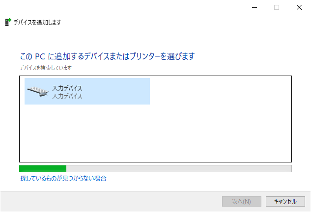

# Wiiリモコン接続マニュアル

まず、PCのBluetoothをオンにしてください。

コントロールパネルから、デバイスとプリンターを開きます。

ここで、既にWiiリモコン(Nintendo RVL-CNT-01)が登録されている場合、「デバイスの削除」をします。

次に、「デバイスの追加」を押し、Wiiリモコン裏のカバー内のSYNC.ボタンを押します。
少し待つと、「入力デバイス」 or 「Nintendo RVL-CNT-01」 等が表示されます。

|||
|---|---|

目的の項目を選択し、「次へ」を押します。 
(ここで失敗することが多々あります。後述の[コツ](#コツ)を一読ください。) 

パスコードを求められますが、入力せず「次へ」。

||**→**||
|---|---|---|

ここまで来て、**Wiiリモコンの点滅が止まらなくなったら**接続完了です。 
そうでない場合は最初からやり直しです。 

また、点滅を止めるにはソフトやプログラムで制御する必要があります。

## コツ

WiiリモコンのSYNC状態は、**約20秒**で終了してしまいます。 
項目選択時の「次へ」を押してから、パスコード入力の「次へ」を押すまでに時間がかかってしまうと、SYNC状態が終了し接続に失敗してしまうことが多々あります。 
解決策として、項目選択時の「次へ」を押す直前に、**もう一度SYNC.ボタンを押す**ことで、成功率を上げることができます。 

||(この間に時間がかかる)||
|---|---|---|

また、接続に失敗しても、デバイス一覧に登録されてしまいます。その都度、「デバイスの削除」を行ってください。 

それでも接続ができない場合は、PCの再起動をしましょう。
