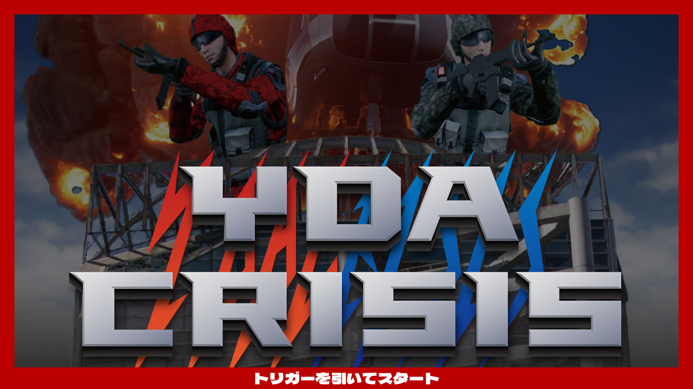
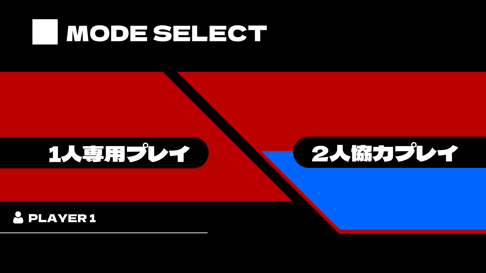
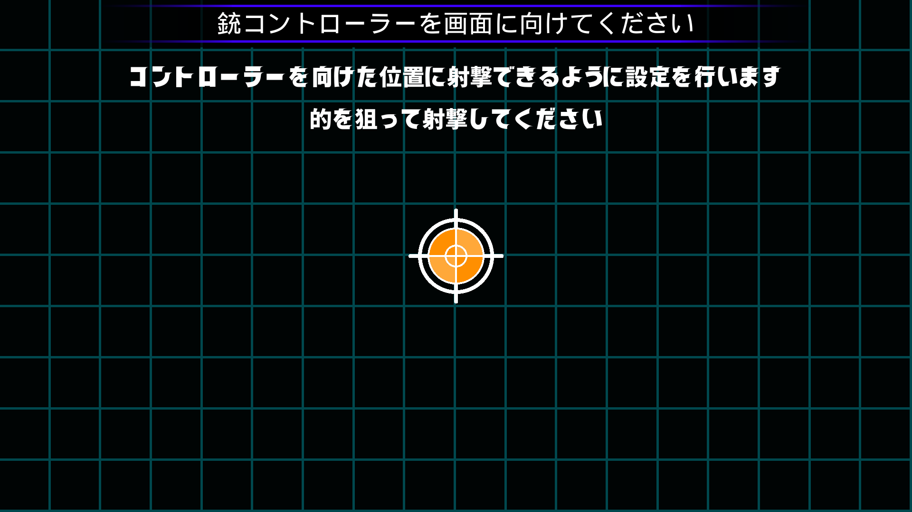
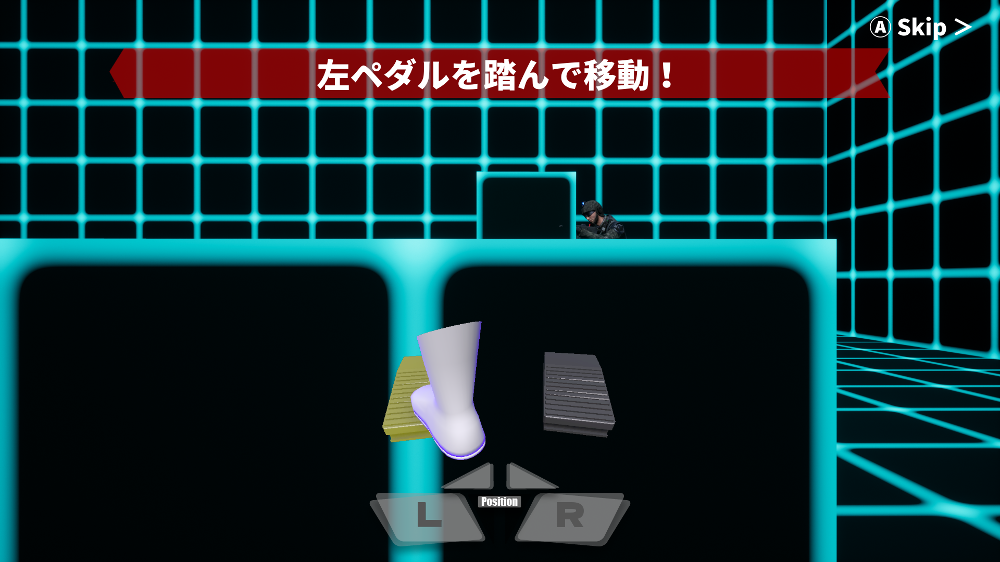
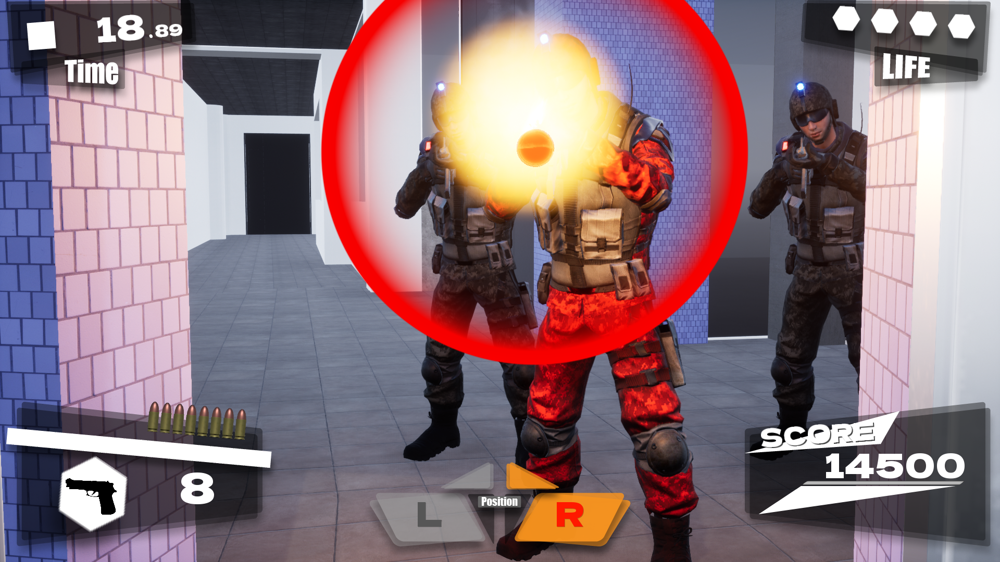

# ゲームプレイマニュアル

YDA CRISISプレイの一連の流れを解説します。
- [1. ゲーム進行・ゲーム画面](./README.md#1-ゲーム進行ゲーム画面)
- [2. 照準キャリブレーションについての詳しい解説](./README.md#2-照準キャリブレーションについての詳しい解説)

### 1. ゲーム進行・ゲーム画面

||画面|説明|
|---|---|---|
|**1**||
**・タイトル画面**

トリガーを引くとゲームプレイが開始されます。 ※この画面ではBGMは流れません
|
|**2**||
**・プレイ人数選択**

1人専用プレイを選択してください。 ※2人協力プレイは使用不可
|
|**3**||
**・照準キャリブレーション画面**

照準キャリブレーションとは、画面にコントローラーを向けた位置の計算を正確に行うための調整です。画面の指示に従って5つの点を射撃してください。
|
|**4**||
**・チュートリアル**

チュートリアルステージです。画面の指示に従いゲームの基本操作を練習しましょう。Aボタン押下でスキップ可能です。
|
|**5**||
**・メインステージ**

チュートリアルが終了し、ムービーが流れた後からゲーム本編が開始となります。YDAに平和を取り戻すために戦いましょう！👊
|

### 2. 照準キャリブレーションについての詳しい解説

`ここに銃の構え方などの画像を載せたい`
